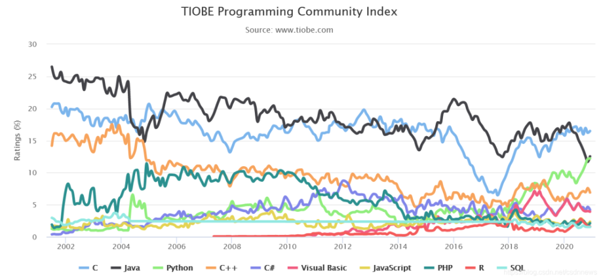

# 为什么学习编程和Python？

## A. 为什么要学习编程？

几乎每个人都知道如何使用电脑，但很少有人采取下一步，学习如何控制它。如果你用了别人的软件，你最会被别人设计好的功能所限制，这个限制就是“别人认为你想做什么”。那写你自己的软件，唯一的束缚将是你自己的想象力。编程会让你变得更有创造性，它让你的思维变得严谨，教会你有逻辑的分析和解决问题。

## B. 为什么是Python？

作为2020年最受工程师欢迎的语言，Python到底有多火？

后端开发、前端开发、爬虫开发、人工智能、金融量化分析、大数据、物联网等，Python应用无处不在，搜索引擎Google的核心代码是Python完成的、迪士尼公司动画生成的Unix版本都内建了Python环境支持、国内知名的豆瓣网是用Python技术建立......

TIOBE编程社区指数（The TIOBE Programming Community index）是编程语言流行度的指标，该榜单每月更新一次，指数基于全球技术工程师、课程和第三方供应商的数量。包括流行的搜索引擎，如谷歌、必应、雅虎、维基百科、亚马逊、YouTube和百度都用于指数计算。

**TIOBE2020年12月排行榜前20名**：

从2002年以来，Python在众多语言中，稳步上升。

**Python的定位是“优雅”、“明确”、“简单”**，所以Python程序看上去总是简单易懂，初学者学Python，不但入门容易，而且将来深入下去，可以编写那些非常非常复杂的程序。

**Python在另一种意义上是免费的，因为它是开源的。**Python项目直到最近仍由其创建者GuidovanRossum领导。它完全是开源和GPL兼容的。

